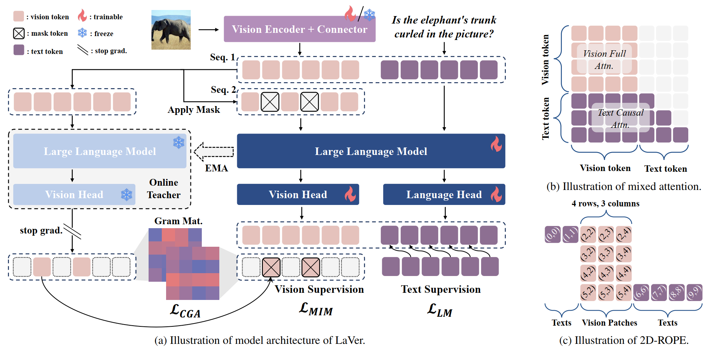

<h1 align="center">Unleashing the Intrinsic Visual Representation Capability of Multimodal Large Language Models</h1>
<p align="center">
  <a href=" https://www.arxiv.org/abs/2512.06281"></a>
  <a href="https://github.com/Fir-lat/LaVer"></a>
  <!-- <a href="https://openreview.net/forum?id=N6ba2xsmds"></a> -->
  <!-- <a href="https://iclr.cc/virtual/2025/poster/29899"></a> -->
  <!-- <a href="https://iclr.cc/media/iclr-2025/Slides/29899.pdf"></a> -->
  <!-- <a href=" https://www.arxiv.org/abs/2512.06281"></a>
  <a href="https://github.com/Fir-lat/LaVer"></a>
  <a href="https://openreview.net/forum?id=N6ba2xsmds"></a>
  <a href="https://openreview.net/forum?id=N6ba2xsmds"></a>
  <a href="https://iclr.cc/media/iclr-2025/Slides/29899.pdf"></a> -->
</p>

This codebase provides a Pytorch implementation for ```LaVer``` in [Unleashing the Intrinsic Visual Representation Capability of Multimodal Large Language Models](https://www.arxiv.org/abs/2512.06281).

<p align="center"></p>
<p align="center"><em>Figure.</em> Depiction of LaVer.</p>


TODO:

- [ ] Update the Project Page of LaVer.
- [ ] Update the checkpoints of LaVer.
- [x] Released the arXiv version of LaVer.
- [x] Released the early version of sample code.

## TL;DR

We train MLLMs with enhanced visual representation capabilities via *Masked Image Modeling* in latent space.

## Abstract

Multimodal Large Language Models (MLLMs) have demonstrated remarkable proficiency in multimodal tasks. Despite their impressive performance, MLLMs suffer from the modality imbalance issue, where visual information is often underutilized compared to textual representations in deeper layers, leading to degraded visual performance or hallucinations. This issue stems from the predominant reliance on next-text-token-prediction during training, which fails to provide direct visual supervisory signals, resulting in progressive homogenization of visual representations throughout the layers. To this end, we propose **La**tent **V**isual R**e**const**r**uction (**LaVer**), a novel training framework that facilitates MLLMs in learning more discriminative visual representations via masked image modeling in the joint latent semantic space of LLM. Our method offers direct visual activation to MLLMs, which exhibit increased visual attention allocation, indicating enhanced utilization of visual information. Extensive experiments across diverse benchmarks prove the superiority of our approach in various scenarios, especially those requiring dense visual capabilities.

## Setup

### Environment

1. Set up a virtualenv with python 3.11.9. You can use pyvenv or conda for this.
2. Run the following to get requirements:
```
pip3 install -e [torch,metrics]
pip3 install transformers==4.56.2 qwen-vl-utils
pip3 install -i deepspeed==0.15.4
pip3 install -i datasets==3.5.0
```

### Datasets

We utilize the open-source datasets:

- Stage 1
    - [LLaVA-Pretrain](https://huggingface.co/datasets/liuhaotian/LLaVA-Pretrain): 558K
- Stage 2
    - [FineVision](https://huggingface.co/spaces/HuggingFaceM4/FineVision): subsampled 800K Image-Text pairs
- Stage 3
    - [LLaVa-OneVision](https://huggingface.co/datasets/lmms-lab/LLaVA-OneVision-Data): subsampled 800K Image-Text pairs

## Starting an Experiment

### Training

- Stage 1: 
```
llamafactory-cli train examples/train_full/laver/laver_1.yaml
```
- Stage 2:
```
llamafactory-cli train examples/train_full/laver/laver_2.yaml
```
- Stage 3:
```
llamafactory-cli train examples/train_full/laver/laver_3.yaml
```

### Evaluation

We use [VLMEvalKit](https://github.com/open-compass/VLMEvalKit) to evaluate our models.

## Reference Code

- huggingface/transformers: [https://github.com/huggingface/transformers](https://github.com/huggingface/transformers)
- hiyouga/LLaMA-Factory: [https://github.com/hiyouga/LLaMA-Factory](https://github.com/hiyouga/LLaMA-Factory)


## Citation

If you find **LaVer** useful or relevant to your research, please kindly cite our paper:

```bibtex
@inproceedings{li2025laver,
  title={Unleashing the Intrinsic Visual Representation Capability of Multimodal Large Language Models},
  author={Li, Hengzhuang and Zhang, Xinsong and Peng, Qiming and Luo, Bin and Hu, Han and Jiang, Dengyang and Ye, Han-Jia and Zhang, Teng and Jin, Hai},
  booktitle={ArXiv},
  year={2025}
}
```


